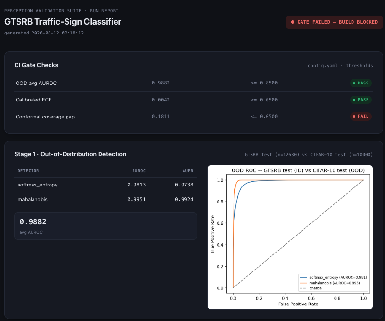
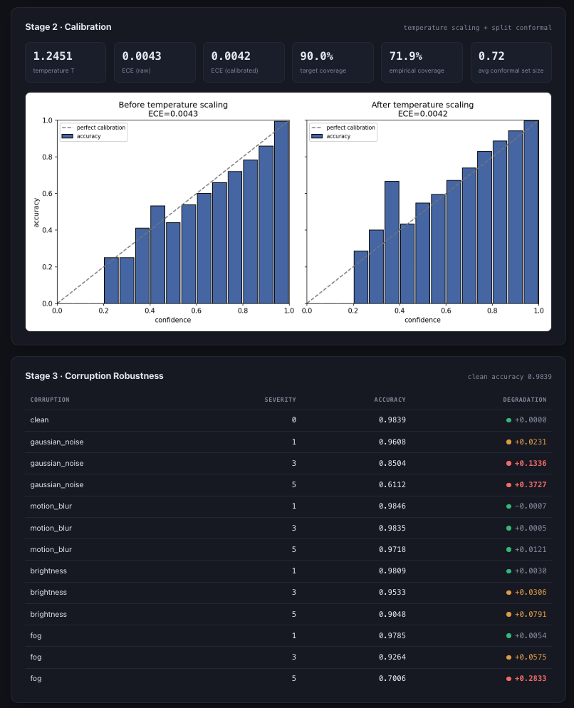

# perception-validation-suite


Checks whether an image classifier can be trusted before it ships: does it know what it doesn't know, is its confidence honest, and how badly does it break under bad conditions. Built and tested on a real model, not simulated.

Validation and monitoring toolkit for a perception model: OOD detection, uncertainty calibration, corruption robustness, CI-gated release checks. ResNet18 fine-tuned on GTSRB traffic signs.

## Model

ResNet18, pretrained on ImageNet, fine-tuned on GTSRB (43 classes). Early layers (conv1, bn1, layer1, layer2) frozen and kept in eval mode during training to stop their batch norm stats from drifting. Pretrained backbone chosen over training from scratch because Mahalanobis OOD detection needs a rich feature space, which a small from-scratch CNN would not give.

Test accuracy: 98.39%.

## Data

GTSRB train set split into training, validation, and calibration subsets. Validation used for temperature scaling. Calibration subset used for split conformal thresholds. GTSRB official test set held out from all of the above, used only for final evaluation. CIFAR-10 test set used only as the OOD negative class, never touched during training or calibration.

## OOD detection

GTSRB test (in-distribution) vs CIFAR-10 test (OOD):

| Detector | AUROC | AUPR |
|---|---|---|
| Softmax entropy | 0.9813 | 0.9738 |
| Mahalanobis | 0.9951 | 0.9924 |

Both clear the 0.85 CI threshold. Mahalanobis wins because it uses the full feature space, not just classifier output. This is far-OOD (traffic icons vs natural photos), an easier separation case than near-OOD.

## Calibration

Temperature scaling: ECE 0.0043 to 0.0042, barely moved, model was already well calibrated.

Split conformal, target 90% coverage: only 71.9% empirical coverage on official test set.

GTSRB's train/test split is by physical sign track, not i.i.d. Calibration data (from train) is not exchangeable with test, so the threshold fit on calibration data does not transfer. Tested a class-conditional conformal variant to check this, coverage moved to 75.3%, a small improvement, confirming the gap is a split/exchangeability problem, not per-class miscalibration. Kept as a separate result, does not touch the main calibration run.

ECE checks confidence-accuracy match on one distribution. Conformal coverage checks whether a threshold generalizes to another distribution. A model can pass one and fail the other.

## Robustness

| Corruption | Sev 1 | Sev 3 | Sev 5 |
|---|---|---|---|
| Gaussian noise | 96.08% | 85.04% | 61.12% |
| Motion blur | 98.46% | 98.35% | 97.18% |
| Brightness | 98.09% | 95.33% | 90.48% |
| Fog | 97.85% | 92.64% | 70.06% |

Clean accuracy is 98.39%. Noise hurts most, corrupts low-level features the model relies on. Motion blur barely matters, traffic signs are shape/color-robust to it. Fog holds up until severity 5, then collapses.

## CI gate

GitHub Actions runs OOD, calibration, and robustness checks on every push:
- OOD avg AUROC >= 0.85
- Calibrated ECE <= 0.05
- Conformal coverage gap <= 0.05

Current run fails on the coverage check (gap 0.1811), correctly blocking the build. OOD and ECE both pass. This is the gate working as intended, catching a real issue an accuracy-only check would miss.

47 tests cover the harness logic itself (config loading, detector math, calibration and conformal correctness, report generation), run via pytest on every push alongside the eval suite.

## Report

Running the report generator produces a single HTML summary of a given run, gate verdict, OOD ROC curve, calibration reliability diagrams, robustness table.




## Structure

```
models/       resnet18 fine-tuning, checkpoint, config
ood/          entropy and mahalanobis detectors
calibration/  temperature scaling, split conformal, class-conditional check
robustness/   corruption suite
ci/           eval gate
reports/      html report generator
tests/        pytest suite
.github/      workflow
```

## Running it

```
pip install -r requirements.txt
python -m models.train
python -m ood.benchmark
python -m calibration.run_calibration
python -m robustness.run_robustness
python -m ci.eval_gate
python -m reports.generate_report
```

Datasets download automatically on first run.

## Notes

Trained locally on Apple Silicon (MPS). CI runs on a CPU-only GitHub runner, so a cold-cache CI run is slower than a local run but produces the same numbers. License: MIT.
